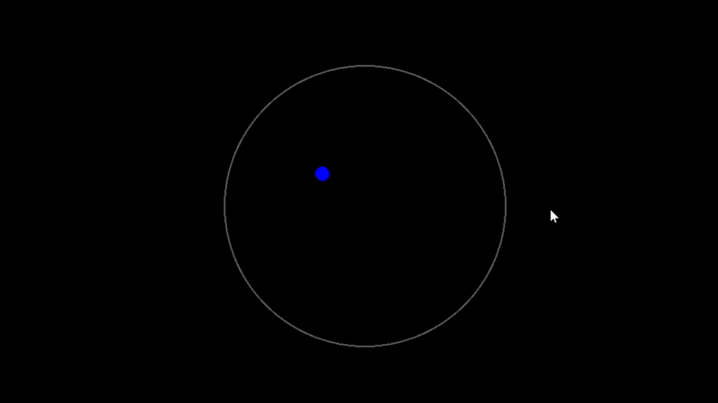

# Pygame Sphere Bounce

## 📸 Demo:


## Description
This project is a simple physics simulation using Python and Pygame. It demonstrates how balls bounce inside a confined circular area, ensuring they remain within the sphere by reflecting off its edges.

## Features
- Click inside the sphere to generate a new ball with a random color and velocity.
- Balls bounce off the sphere’s edges using vector-based reflection.
- Smooth animation with Pygame’s rendering loop.

## Installation
1. Ensure you have Python installed (Python 3.x recommended).
2. Install Pygame if you haven’t already:
   ```sh
   pip install pygame
   ```
3. Clone this repository or copy the script to your local machine.

## Usage
Run the script with:
```sh
python pygame_sphere.py
```
Click inside the sphere to generate bouncing balls.

## 📺 Video Overview:
[](https://www.youtube.com/shorts/WVeSOaFNxkU)


## Requirements
- Python 3.x
- Pygame

## License
This project is open-source and available under the MIT License.

## Author
Kseniia Lala Land https://github.com/Lala0Land

